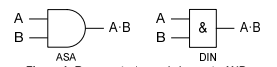
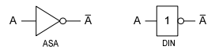

# Operacións lóxicas

No sistema decimal realizamos operacións entre números. Estas operacións son a suma, resta, multiplicación,... Estas tamén se poden realizar en calquera outro sistema de numeración.

No noso caso, non nos van interesas realizar estas operacións en binario. As que nos interesan son as **operación lóxicas**. En concreto as operacións **AND**  , **OR** y **NOT**. 

## Operación AND

A operación **AND** realízase a nivel de bit.

Dadas as variables x e y, o resultado de efectuar a operación AND entre elas e 1 se as dúas variables son 1. En caso contrario o resultado é 0.

| x    | y    | x AND y |
| ---- | ---- | ------- |
| 0    | 0    | 0       |
| 0    | 1    | 0       |
| 1    | 0    | 0       |
| 1    | 1    | 1       |

Exemplo:

- x = 110011 
- y = 1101

|         |      |      |      |      |      |      |
| ------- | ---- | ---- | ---- | ---- | ---- | ---- |
| x       | 1    | 1    | 0    | 0    | 1    | 1    |
| y       | (0)  | (0)  | 1    | 1    | 0    | 1    |
| z AND y | 0    | 0    | 0    | 0    | 0    | 1    |

##### Representación da porta AND

## Operación OR 

A operación **OR** realízase a nivel de bit.

Dadas as variables x e y, o resultado de efectuar a operación OR entre elas e 1 se algunha das variables ten o valor 1. En caso contrario o resultado é 0.

| x    | y    | x OR y |
| ---- | ---- | ------ |
| 0    | 0    | 0      |
| 0    | 1    | 1      |
| 1    | 0    | 1      |
| 1    | 1    | 1      |

Exemplo:

- x = 110011 
- y = 1101

|         |      |      |      |      |      |      |
| ------- | ---- | ---- | ---- | ---- | ---- | ---- |
| x       | 1    | 1    | 0    | 0    | 1    | 1    |
| y       | (0)  | (0)  | 1    | 1    | 0    | 1    |
| z AND y | 1    | 1    | 1    | 1    | 0    | 1    |

##### Representación da porta OR

## Operación NOT (Inversor) 

Es el único operador lógico que tiene una sola entrada y una única salida (operador unario). Esta salida devuelve el valor opuesto al que recibe, razón por la cual se suele denominar inversor.

| A    | !A   |
| ---- | ---- | 
| 0 | 1 | 
| 1 | 0 | 

## Aplicaciones prácticas

En informática, y en concreto en redes, estos operadores suelen aplicarse sobre un conjunto más o menos grande de bites (el contenido de un registro, una dirección IP, una máscara de subred, etc.) y es necesario tener en cuenta que se debe aplicar, el operador, a todos y cada uno de los bites del conjunto. Pudiendo darse dos casos, que se trate de un operador con una única entrada (inversor) o un operador de entradas múltiples.
#### Inversor.

Cuando el operador NOT se aplica sobre un conjunto de bites, se invierten todos y cada uno de los bites del conjunto, uno a uno.
Por ejemplo, el resultado de un operado NOT sobre el byte 10101010 sería 01010101, en el que se invirtió el valor de cada uno
de los bites del byte.

#### Operadores de entradas múltiples

Cuando se trata de operadores que requieren más de una entrada, el operador se aplica, bit a bit, sobre los bites de las entradas que ocupan posiciones idénticas.
Por ejemplo, aplicaremos el operador AND a los siguientes bytes; 10100111 y 11001001.

**10100111** 
**11001001**

**Resultado AND: 10000001**

Una forma de evitar equivocaciones es disponerlos como en una suma, ya que nos permite, por un lado, comprobar que tengan el mismo número de bites ambas entradas y por otro, nos facilita la operación evitando errores, sobre todo cuando el número de bites a tratar sea grande.